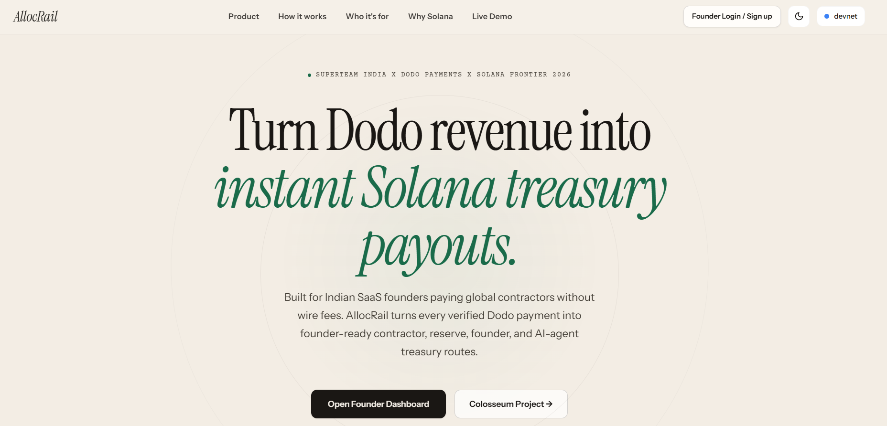
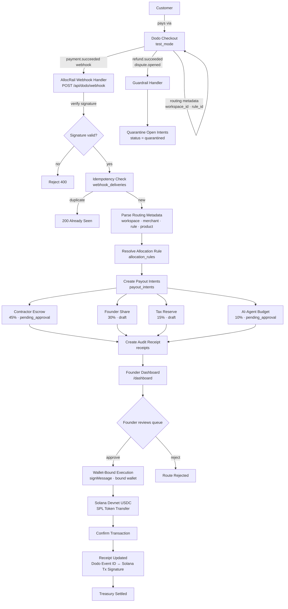

<div align="center">


<br /><br />



<br /><br />

# AllocRail

### *Dodo revenue in. AllocRail routes. Solana settles.*

**The programmable treasury layer after Dodo Payments revenue lands.**

AllocRail turns verified Dodo payment and billing events into founder-controlled Solana USDC payout intents for contractor escrow, tax reserves, founder shares, and AI-agent budgets, with receipt-backed proof after settlement.

<br />

[](https://youtu.be/dh3fVsnuYUk)
[](https://www.allocrail.dev)
[](https://docs.google.com/presentation/d/1XgbkyhXIEquwz5bkZqLruIEXJO21z5kT-o1kfSrKadg/edit?usp=sharing)
[](https://arena.colosseum.org/projects/explore/allocrail)

<br />

</div>

---

## The Problem

Global SaaS and AI founders can already collect revenue with Dodo Payments. Post-revenue treasury operations are still manual:

- spreadsheet-based contractor and founder splits
- delayed Wise, PayPal, and wire payouts
- manual tax reserve tracking
- refund and dispute risk after money has already been routed
- no clean proof chain from customer payment to downstream treasury movement
- no isolated machine budget for AI agents and tools

This is especially painful for Indian SaaS founders selling globally and paying distributed teams across borders.

---

## The Solution

```text
Dodo checkout -> verified webhook -> allocation rule -> payout intents -> Solana USDC settlement -> audit receipt
```

AllocRail sits **after Dodo revenue lands**. It does not replace billing. Dodo remains the compliant revenue source of truth. AllocRail handles treasury routing, founder approvals, wallet-bound execution, and receipt-backed proof.

---

## Architecture



---

## Demo

<div align="center">

[](https://youtu.be/dh3fVsnuYUk)

**Dodo checkout -> verified webhook -> payout intents -> Solana devnet USDC settlement -> audit receipt**

</div>

---

## Core Flow

| Step | What Happens | Tech |
|------|--------------|------|
| **1. Checkout** | Customer pays via Dodo hosted checkout with AllocRail routing metadata | `dodopayments` SDK · `POST /api/dodo/checkout` |
| **2. Webhook** | Dodo fires `payment.succeeded` and AllocRail verifies the signature | `client.webhooks.unwrap()` |
| **3. Idempotency** | `webhook-id` is checked before any treasury state is created | `webhook_deliveries` table |
| **4. Rule Match** | Metadata resolves to a founder-owned allocation rule | `allocation_rules` · basis point validation |
| **5. Payout Intents** | Treasury buckets are created with approval-aware statuses | `payout_intents` |
| **6. Founder Review** | Approval-required routes are reviewed before execution | Dashboard queue |
| **7. Solana Settle** | Wallet-bound SPL token transfer sends USDC to recipient wallets | `@solana/spl-token` · `@solana/web3.js` |
| **8. Audit Receipt** | Receipt links Dodo event, allocation rule, payout intents, and Solana proof | `receipts` table · HTML export |

---

## Dodo Payments Integration

AllocRail uses Dodo across multiple real product surfaces:

| Integration Point | Description |
|-------------------|-------------|
| **Checkout Sessions** | Creates real Dodo checkout sessions with `workspace_id`, `merchant_id`, `rule_id`, and `product_tag` routing metadata |
| **Verified Webhooks** | Signature verification through the official Dodo SDK plus replay-window checks |
| **Idempotency** | `webhook-id` deduplication prevents duplicate treasury routes |
| **Subscription Lifecycle** | Handles `subscription.active`, `subscription.renewed`, `subscription.cancelled`, and `subscription.updated` |
| **Credit Events** | Maps `credit.added`, `credit.deducted`, and `credit.balance_low` into AI-agent budget signals |
| **Refund / Dispute Guards** | Refund and dispute events can quarantine open payout intents before Solana execution |
| **Dodo Receipts** | Proxies Dodo payment and refund receipts for founder download |

---

## Solana Integration

| Feature | Implementation |
|---------|---------------|
| **Devnet USDC** | `4zMMC9srt5Ri5X14GAgXhaHii3GnPAEERYPJgZJDncDU` |
| **SPL Token Transfers** | `@solana/spl-token` · `transferChecked` · ATA creation |
| **Wallet Binding** | Wallet-standard `signMessage` challenge/verify for treasury operator auth |
| **Explorer Links** | Every confirmed payout links to Solana Explorer on devnet |
| **Anchor Scaffold** | `anchor/` program scaffold for a future vault-based policy layer |
| **@solana/kit** | RPC helpers, balance hooks, and cluster wiring |

---

## Product Surface

```text
/                              Landing page with product demo and checkout
/login                         Founder sign in
/signup                        Founder sign up
/dashboard                     Overview
/dashboard/events              Revenue inbox
/dashboard/payout-intents      Settlement queue
/dashboard/receipts            Audit receipt history
/dashboard/rules               Allocation rule management + AI drafting
/dashboard/settings            Founder profile, wallet binding, treasury config
/checkout/success              Post-checkout success and route claim flow
```

---

## API Surface

```text
GET    /api/health
GET    /api/allocrail/demo
GET    /api/allocrail/events                        (+ ?format=csv)
GET    /api/allocrail/payout-intents
GET    /api/allocrail/receipts
GET    /api/allocrail/payments/[id]/receipt
POST   /api/allocrail/payments/[id]/refund
GET    /api/allocrail/refunds/[id]/receipt
POST   /api/allocrail/payout-intents/[id]/approve
POST   /api/allocrail/payout-intents/[id]/reject
POST   /api/allocrail/payout-intents/[id]/execute
GET    /api/allocrail/rules
POST   /api/allocrail/rules
POST   /api/allocrail/copilot/rule-draft
POST   /api/allocrail/copilot/reconcile-summary
POST   /api/allocrail/copilot/budget-summary
POST   /api/allocrail/wallet-binding/challenge
POST   /api/allocrail/wallet-binding/verify
DELETE /api/allocrail/wallet-binding
GET    /api/dodo/checkout
POST   /api/dodo/checkout
POST   /api/dodo/webhook
```

---

## What Is Built

### Product proof

- live deployed product at [allocrail.dev](https://www.allocrail.dev)
- full checkout-to-receipt flow
- founder-owned workspaces and isolated routing metadata
- wallet-bound approve / reject / execute controls
- receipt download and proof inspection flows

### Integration proof

- real Dodo checkout session creation
- verified webhook ingestion
- idempotency protection
- payout intents generated from rule matches
- refund request flow and dispute-aware quarantine handling
- subscription lifecycle and credit-event handling

### Settlement proof

- wallet-signed Solana devnet USDC settlement path
- explorer-verifiable transaction links
- audit receipts tying Dodo events to downstream Solana proof

Current build verification:

- `npm run build` passes

---

## Milestone Status

| Milestone | Description | Status |
|-----------|-------------|--------|
| **M1** | API foundation, health check, types, demo route | ✅ Complete |
| **M2** | Live Dodo checkout flow with routing metadata | ✅ Complete |
| **M3** | Verified Dodo webhook, idempotency, revenue inbox | ✅ Complete |
| **M4** | Founder dashboard and workflow pages | ✅ Complete |
| **M5** | Solana devnet USDC settlement, Supabase persistence, founder auth | ✅ Complete |
| **M6** | Approval controls, refund flow, dispute quarantine, wallet binding | ✅ Complete |
| **M7** | Subscription lifecycle, credit events, treasury config, FX routing | ✅ Complete |
| **M8** | AI treasury copilot for rules and summaries | ✅ Complete |
| **M9** | Submission polish, demo hardening, receipt template | ✅ Complete |

---

## Stack

| Layer | Technology |
|-------|------------|
| **Frontend** | Next.js 16 · React 19 · TypeScript |
| **Styling** | Tailwind CSS 4 · CSS modules |
| **Payments** | Dodo Payments SDK |
| **Auth + Database** | Supabase Auth · Postgres · SSR helpers |
| **Solana Client** | `@solana/kit` · `@solana/web3.js` · `@solana/spl-token` · wallet-standard |
| **Program Path** | Anchor scaffold for future vault policy logic |
| **AI Copilot** | OpenAI `gpt-4o-mini` |

---

## Local Development

### Prerequisites

- Node.js 20+
- a [Dodo Payments](https://dodopayments.com) test account
- a [Supabase](https://supabase.com) project
- a Solana wallet

### Setup

```bash
git clone https://github.com/NikhilRaikwar/AllocRail
cd AllocRail
npm install
cp .env.example .env
```

### Environment Variables

```env
# App
NEXT_PUBLIC_APP_URL=http://localhost:3000

# Supabase
NEXT_PUBLIC_SUPABASE_URL=your_supabase_url
NEXT_PUBLIC_SUPABASE_ANON_KEY=your_anon_key
SUPABASE_SERVICE_ROLE_KEY=your_service_role_key

# Dodo Payments
DODO_PAYMENTS_API_KEY=your_dodo_api_key
DODO_PAYMENTS_WEBHOOK_SECRET=your_webhook_secret
DODO_PAYMENTS_ENVIRONMENT=test_mode
DODO_TEST_PRODUCT_ID=your_product_id

# OpenAI
OPENAI_API_KEY=your_openai_key
OPENAI_BASE_URL=https://api.openai.com/v1

# Solana
SOLANA_RPC_URL=https://api.devnet.solana.com
SOLANA_CLUSTER=devnet
SOLANA_USDC_MINT=4zMMC9srt5Ri5X14GAgXhaHii3GnPAEERYPJgZJDncDU
TREASURY_SIGNER_SECRET_KEY=your_treasury_keypair
```

### Apply Supabase Migrations

Run these in order:

```text
supabase/migrations/20260507_allocrail_milestone_5.sql
supabase/migrations/20260507_allocrail_milestone_6.sql
supabase/migrations/20260508_allocrail_milestone_7_dodo_depth.sql
supabase/migrations/20260508_allocrail_receipt_sources.sql
supabase/migrations/20260508_allocrail_founder_rls.sql
supabase/migrations/20260509_allocrail_wallet_binding_treasury_config.sql
```

### Run

```bash
npm run dev
```

Open:

```text
http://localhost:3000
```

### Webhook Testing

Forward Dodo webhooks to your local server with a tunnel:

```bash
ngrok http 3000
```

Set your Dodo webhook endpoint to:

```text
https://your-ngrok-url/api/dodo/webhook
```

---

## Security Design

| Control | Implementation |
|---------|---------------|
| **Webhook auth** | Dodo signature verification through the official SDK |
| **Replay protection** | Timestamp window check plus `webhook-id` storage |
| **Wallet binding** | `signMessage` challenge/verify before treasury execution |
| **Approval gates** | Sensitive buckets require explicit founder approval |
| **Refund / dispute quarantine** | Open intents are frozen on supported guardrail events |
| **Founder isolation** | Founders only see their own workspace-scoped data |
| **Structured AI outputs** | Copilot routes use structured outputs, not free-form settlement logic |

---

## India Context

AllocRail is designed around a real India-to-global founder workflow:

1. Dodo handles compliant INR and global fiat collection.
2. AllocRail routes revenue into programmable treasury buckets.
3. Founders can manage FX assumptions and treasury routing from one dashboard.
4. Solana settlement gives a low-cost proof surface for global downstream payouts.

---

## Research and Build Context

This project was planned and refined with:

- **solana.new skills** for technical planning, Solana product framing, and submission prep
- **Colosseum Copilot** for competitive landscape review and wedge validation

Relevant project context files:

- [docs/ALLOC_RAIL_BUILD_PLAN.md](docs/ALLOC_RAIL_BUILD_PLAN.md)
- [docs/ALLOC_RAIL_DODO_TRACK_PLAN.md](docs/ALLOC_RAIL_DODO_TRACK_PLAN.md)
- [docs/AGENTIC_ENGINEERING_EVIDENCE.md](docs/AGENTIC_ENGINEERING_EVIDENCE.md)
- [docs/SUBMISSION_COPY.md](docs/SUBMISSION_COPY.md)

---

## Resources

| Resource | Link |
|----------|------|
| Live App | [allocrail.dev](https://www.allocrail.dev) |
| Demo Video | [youtu.be/dh3fVsnuYUk](https://youtu.be/dh3fVsnuYUk) |
| Pitch Deck | [Google Slides](https://docs.google.com/presentation/d/1XgbkyhXIEquwz5bkZqLruIEXJO21z5kT-o1kfSrKadg/edit?usp=sharing) |
| Colosseum | [arena.colosseum.org/projects/explore/allocrail](https://arena.colosseum.org/projects/explore/allocrail) |
| X / Twitter | [@AllocRail](https://x.com/AllocRail) |
| GitHub | [NikhilRaikwar/AllocRail](https://github.com/NikhilRaikwar/AllocRail) |
| Dodo Docs | [docs.dodopayments.com](https://docs.dodopayments.com) |

---

## Built For

**Solana Frontier Hackathon 2026** · Dodo Payments × Superteam India Prize Track

---

<div align="center">

**MIT License**

[](https://github.com/NikhilRaikwar/AllocRail)
[](https://x.com/AllocRail)
[](https://explorer.solana.com/?cluster=devnet)

</div>
