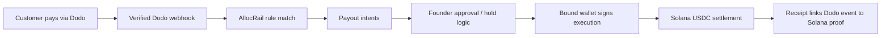

# AllocRail

**Turn Dodo revenue into instant Solana treasury payouts.**


AllocRail is the programmable treasury layer after Dodo revenue lands. Dodo handles compliant checkout, subscriptions, credits, refunds, and verified billing events. AllocRail converts those verified revenue events into founder-controlled treasury routes for contractor payouts, tax reserves, founder distributions, and AI-agent budgets, then settles them on Solana with receipt-backed proof.

## One-Line Demo

```text
Dodo revenue comes in.
AllocRail splits it.
Founder approves it.
Solana settles it.
Receipt proves it.
```

## Problem

SaaS and AI founders can collect money globally, but post-revenue treasury work is still manual:

- contractor payouts still live in spreadsheets
- tax reserves are tracked outside the billing system
- refunds and disputes create real payout risk
- cross-border wires are slow and expensive
- there is no clean proof chain from customer payment to downstream treasury movement
- AI-agent/tool spend is rarely isolated from founder treasury

This is worse for Indian SaaS founders collecting globally and paying distributed teams across borders.

## Solution

AllocRail sits after Dodo revenue collection and before treasury settlement.

It:

- creates Dodo checkout sessions with treasury-routing metadata
- verifies signed Dodo webhooks
- enforces idempotency and replay protection
- matches revenue to founder-defined allocation rules
- generates payout intents with approval and hold controls
- executes wallet-signed Solana USDC treasury payouts
- records receipts that link Dodo events to Solana proof

## Why This Project Fits the Dodo Track

AllocRail uses Dodo in a meaningful way. It does not wrap Dodo checkout with cosmetic stablecoin branding. Dodo is the verified revenue source of truth for:

- one-time payments
- subscriptions
- credit events
- refunds
- disputes
- receipt source linkage

AllocRail’s wedge is not checkout. It is **post-revenue treasury routing**.

## Why Solana

Solana is the payout rail, not decoration.

- fast multi-recipient settlement
- low-cost treasury operations
- programmable payout routing
- wallet-native execution
- explorer-verifiable proof

The result is better than spreadsheets plus bank transfers for this exact workflow.

## Core Flow

```text
Dodo checkout
-> verified webhook
-> allocation rule match
-> payout intents
-> founder approval / hold logic
-> wallet-signed Solana USDC settlement
-> audit receipt
```

## Product Surfaces

- `/` landing page with track-specific positioning
- `/login` founder auth
- `/dashboard` overview with seeded demo state when no live routing data exists
- `/dashboard/events` revenue event inbox
- `/dashboard/payout-intents` grouped treasury queue
- `/dashboard/receipts` proof history
- `/dashboard/rules` allocation rule management + AI drafting
- `/dashboard/settings` founder profile, wallet binding, treasury config

## Trust Model

- founder identity uses Supabase Auth
- treasury operator wallet is cryptographically bound by signed challenge
- sensitive payout actions require the bound wallet
- refund/dispute flows can quarantine unsettled routes
- receipts bind Dodo event data, allocation logic, and Solana proof into one audit surface

## What Is Built

### Dodo integration

- real checkout session creation
- routing metadata on checkout
- verified webhook ingestion
- idempotency protection
- refund request flow
- dispute/refund-aware payout holds
- subscription lifecycle handling
- credit event handling

### Treasury layer

- allocation rules in basis points
- payout intent generation
- grouped payout routes by payment
- approve / reject / execute controls
- wallet-signed execution
- treasury refill / FX configuration
- audit receipts

### Founder experience

- non-empty seeded demo state for first-run judge sessions
- dashboard stats and route visibility
- receipt history and receipt proof view
- CSV export for revenue events
- AI treasury copilot:
  - rule drafting
  - queue summary
  - budget-risk summary

## Architecture



## Competitive Positioning

Colosseum Copilot validation for this project surfaced the crowded cluster as **Stablecoin Payment Rails and Infrastructure**. Similar entries include projects like `Tributary`, `x402 Agnic Hub`, and `Pistis Pay`.

The important conclusion is:

- generic payment rails are crowded
- generic billing automation is crowded
- “payments” by itself is not a strong differentiator

AllocRail’s strongest wedge is:

**Dodo revenue in -> founder-controlled treasury routing -> Solana settlement proof**

## Current Status

Completed:

- Milestone 1: API foundation
- Milestone 2: Dodo checkout
- Milestone 3: verified webhook routing
- Milestone 4: founder dashboard
- Milestone 5: Solana devnet USDC settlement
- Milestone 6: approvals and safety guardrails
- Milestone 7: deeper Dodo semantic coverage
- Milestone 8: treasury copilot
- Milestone 9 product work: founder demo flow and branded treasury surfaces

Current build verification:

- `npm run build` passes

## Stack

| Layer | Technology |
| --- | --- |
| Frontend | Next.js, React, TypeScript |
| Payments | Dodo Payments |
| Storage | Supabase |
| Solana client | `@solana/web3.js`, `@solana/spl-token`, wallet-standard |
| Program path | Anchor scaffold for future policy vault |
| AI | OpenAI `gpt-4o-mini` |

Devnet USDC mint:

```text
4zMMC9srt5Ri5X14GAgXhaHii3GnPAEERYPJgZJDncDU
```

## Local Development

Install:

```bash
npm install
```

Configure env:

```bash
cp .env.example .env
```

Required variables:

```text
NEXT_PUBLIC_SUPABASE_URL
NEXT_PUBLIC_SUPABASE_ANON_KEY
SUPABASE_SERVICE_ROLE_KEY
OPENAI_API_KEY
OPENAI_BASE_URL
```

Apply Supabase migrations:

```text
supabase/migrations/20260507_allocrail_milestone_6.sql
supabase/migrations/20260508_allocrail_milestone_7_dodo_depth.sql
supabase/migrations/20260508_allocrail_receipt_sources.sql
supabase/migrations/20260508_allocrail_founder_rls.sql
supabase/migrations/20260509_allocrail_wallet_binding_treasury_config.sql
```

Run:

```bash
npm run dev
```

Open:

```text
http://localhost:3000
```

## Hackathon Packaging

Phase 7 submission assets live in:

- `docs/SUBMISSION_COPY.md`
- `docs/HACKATHON_SUBMISSION.html`
- `docs/PITCH_DECK.md`
- `docs/PITCH_DECK.html`

## Links

- GitHub: [NikhilRaikwar/AllocRail](https://github.com/NikhilRaikwar/AllocRail)
- Colosseum: [AllocRail on Colosseum](https://arena.colosseum.org/projects/explore/allocrail)
- X: [@AllocRail](https://x.com/AllocRail)

## License

MIT
